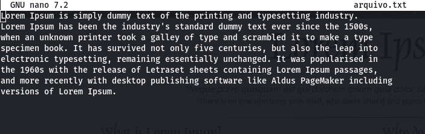
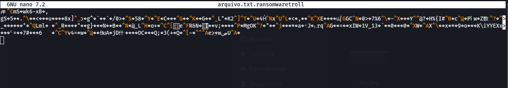

<p align="center">
  <a href="#project">Project</a>&nbsp;&nbsp;&nbsp;|&nbsp;&nbsp;&nbsp;
  <a href="#-technologies">Technologies</a>&nbsp;&nbsp;&nbsp;|&nbsp;&nbsp;&nbsp;
  <a href="#-Getting started">Getting started</a>&nbsp;&nbsp;&nbsp;|&nbsp;&nbsp;&nbsp;
  <a href="#-layout">Screenshot</a>&nbsp;&nbsp;&nbsp;|&nbsp;&nbsp;&nbsp;
</p>

<br>

---

## 💻 Projeto

Projeto pratico para a Formação Cybersecurity Specialist da DIO.me:
Objetivo: Criar um ransomware para criptografar um arquivo e que depois podemos descriptografar

## 🧪 Technologies

This project was developed using the following technologies:
 
- [Kali Linux](https://www.kali.org/)
- [Python](https://www.python.org/)
- [pyaes](https://pypi.org/project/pyaes/)

## 🚀 Getting started

Clone the project and access the folder.

```bash
$ git clone https://github.com/MaykonRaphael/cybersecurity-ransomware-com-python.git
$ cd cybersecurity-ransomware-com-python
```

File '.txt' content
<h1 align="center">
    
</h1>

Encrypting the file
```bash
$ python encrypter.py
```

Opening file '.txt' encrypted
```bash
$ nano arquivo.txt.ransomwaretroll
```
File '.txt' content encrypted
<h1 align="center">
    
</h1>

Decrypting the file
```bash
$ python decrypter.py
```

Opening file '.txt' decrypted
```bash
$ nano arquivo.txt
```
File content encrypted
<h1 align="center">
    
</h1>